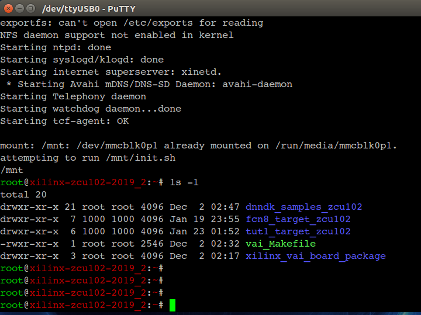
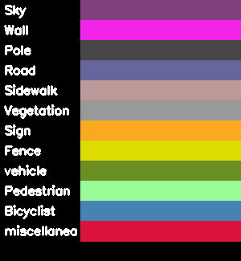
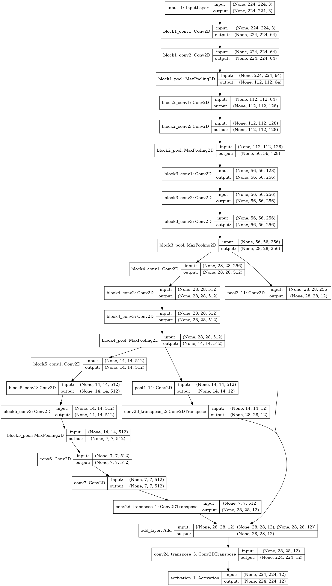
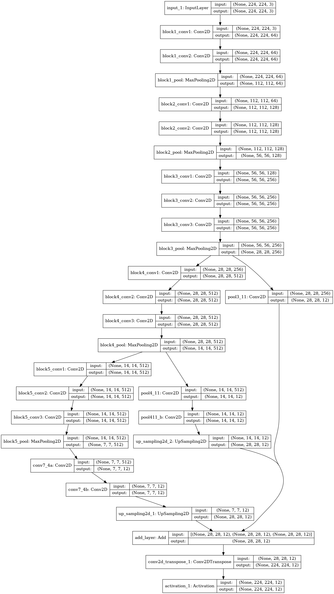
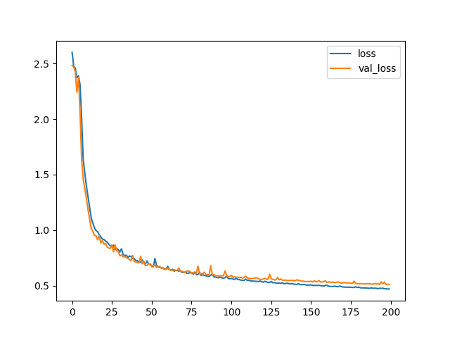
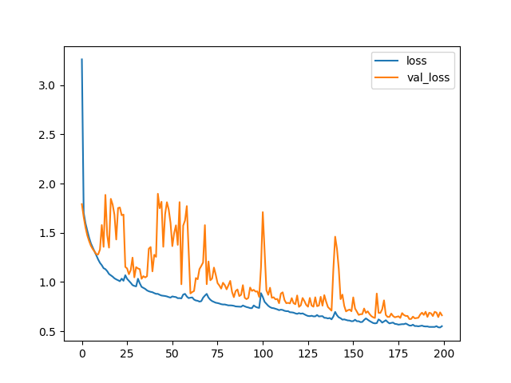
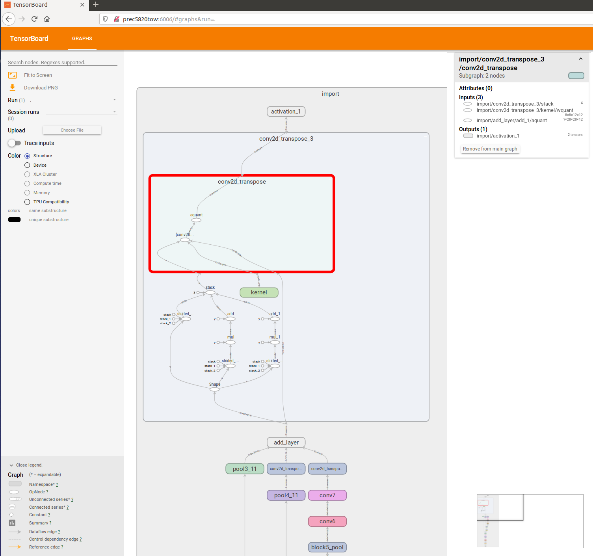
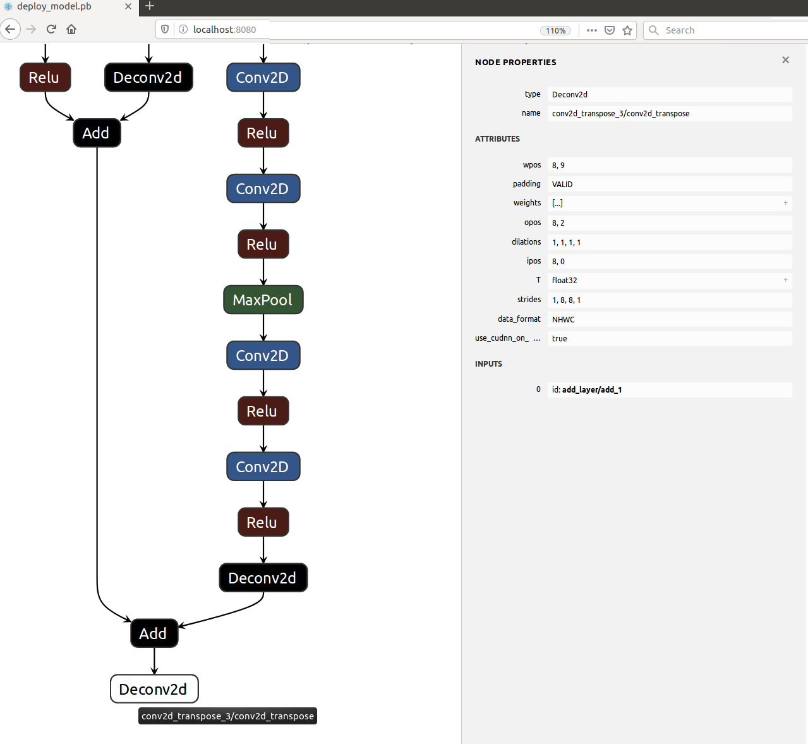
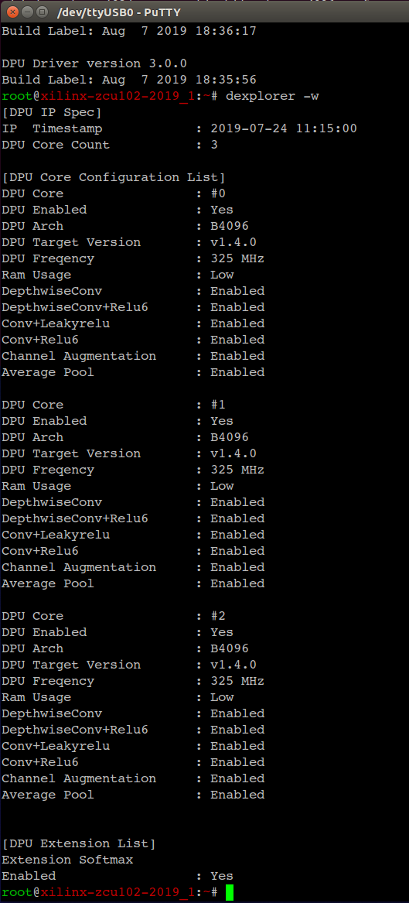

<div style="page-break-after: always;"></div>
<table style="width:100%">
  <tr>
    <th width="100%" colspan="6"><h1>FCN8 and UNET Semantic Segmentation with Keras and Xilinx Vitis AI</h1>
</th>
  </tr>
</table>
</div>

### Current status

1. Tested with Vitis AI 1.0

2. Tested in hardware on zcu102

Any questions, comments or errors found - please email me directly: daniele.bagni@xilinx.com


# Introduction

In this Deep Learning (DL) tutorial, you will train the [FCN8](http://deeplearning.net/tutorial/fcn_2D_segm.html) and [UNET](https://towardsdatascience.com/understanding-semantic-segmentation-with-unet-6be4f42d4b47) Convolutional Neural Networks (CNNs) for Semantic Segmentation in Keras adopting a small custom dataset, then you will quantize the floating point weights files to an 8-bit fixed point  representation to finally deploy them on the Xilinx&reg; [ZCU102](https://www.xilinx.com/products/boards-and-kits/ek-u1-zcu102-g.html) board using [Vitis AI](https://developer.xilinx.com/en/get-started/ai.html), which is a set of optimized IP, tools libraries, models and example designs valid for AI inference on both Xilinx edge devices and Alveo cards.

Once the selected CNN has been correctly trained in Keras, the [HDF5](https://www.hdfgroup.org/solutions/hdf5/) file of weights is converted into a TF checkpoint and inference graph file, such frozen graph is then quantized by the Vitis AI Quantizer that creates an INT8 ``pb`` file from which the Vitis AI Compiler generates the ``elf`` file of micro instructions for the Deep Processor Unit (DPU) of the Vitis AI platform. The final application is executed at run time - via Python APIs - on the target board to make predictions that can be compared against the simulation reference results.


# Pre-requisites

- An Ubuntu 16.04 host PC with Python 3.6  and its package python3.6-tk installed (this last one installed with ``sudo apt-get install python3.6-tk``);

- [Vitis AI stack release 1.0](https://github.com/Xilinx/Vitis-AI) from [www.github.com/Xilinx](https://www.github.com/Xilinx). In particular, refer to the [Vitis AI User Guide UG1414 v1.0](https://www.xilinx.com/support/documentation/sw_manuals/vitis_ai/1_0/ug1414-vitis-ai.pdf) for the installation guidelines and note that you need to download the two containers available from [docker hub](https://hub.docker.com/r/xilinx/vitis-ai/tags):
  - **tools container** with tag ``tools-1.0.0-cpu``, here ``cpu`` means that this environment runs on the host PC only with CPU support (in other words without any GPU need). Note also that UG1414 explains how to build your own container with GPU support;
  - **runtime container** with tag ``runtime-1.0.1-cpu``, note that you need this container only once to prepare SD card content of the target board, then you will compile all the applications directly on the target board itself, which means you do not cross-compile them from the host PC.

- Vitis AI Evaluation board [ZCU102](https://www.xilinx.com/products/boards-and-kits/ek-u1-zcu102-g.html) with its [image file](https://www.xilinx.com/bin/public/openDownload?filename=xilinx-zcu102-dpu-v2019.2.img.gz), which contains a pre-built working design for the ZCU102 with the [DPU-v2](https://github.com/Xilinx/Vitis-AI/tree/master/DPU-TRD).

- Familiarity with Deep Learning principles.

# Before starting

Here are the new things you have to learn about Docker in order to run the Vitis AI smoothly.

Assuming your working directory ``<WRK_DIR>`` is for example ``$HOME/ML/VAI/Vitis-AI``.

To list the currently available docker images run:
```bash
docker images # to list the current docker images available in the host pc
```
and you should see something like in the following text:
```text
REPOSITORY                             TAG                 IMAGE ID            CREATED             SIZE
xilinx/vitis-ai                        tools-1.0.0-gpu     034a766d9641        3 hours ago         12GB
xilinx/vitis-ai                        runtime-1.0.0-cpu   af058b4c48b3        6 weeks ago         11.9GB
xilinx/vitis-ai                        tools-1.0.0-cpu     7b7550aac2e6        6 weeks ago         8.35GB
```

To launch the docker container with Vitis AI tools (from CNN training to generation of the ELF file) for CPU (or GPU) from the ``<WRK_DIR>`` folder:
```bash
cd <WRK_DIR> # you are now in Vitis_AI subfolder
./docker_run.sh xilinx/vitis-ai:tools-1.0.0-cpu  # only CPU
#./docker_run.sh xilinx/vitis-ai:tools-1.0.0-cpu # alternatively: only GPU
```

To launch the docker container with Vitis AI runtime (to compile the whole application for the target board) from the ``<WRK_DIR>`` folder:
```bash
./runtime/docker_run.sh xilinx/vitis-ai:runtime-1.0.0-cpu
```

Note that both the two containers map the shared folder ``/workspace`` with the file system of the Host PC from where you launch the above command, which is ``<WRK_DIR>`` in your case. This shared folder enables you to transfer files from the Host PC to the docker container and vice versa.


### Install Missing Packages on the Vitis AI Tools Container

This tutorial requires some packages that were not included in the original Vitis AI tools container. Here are the commands to include such packages:
```bash
./docker_run.sh xilinx/vitis-ai:tools-1.0.0-cpu # enter into the docker VAI tools image
sudo su # you must be root
conda activate vitis-ai-tensorflow # as root, enter into Vitis AI TF (anaconda-based) virtual environment
conda install matplotlib
conda install pandas
conda install seaborn
conda install pycairo==1.18.2
# you cannot install next packages with conda, so use pip instead
pip install imutils==0.5.1
pip install keras=2.2.4
conda deactivate
exit # to exit from root
conda activate vitis-ai-tensorflow # as normal user, enter into Vitis AI TF (anaconda-based) virtual environment
```
Note that if you exit from the current Docker Vitis AI tools image you will lose all the installed packages, so to save all changes in a new docker image open a new terminal and run the following commands:

```bash
sudo docker ps -l # To get the Docker CONTAINER ID
```
you will see the following text (the container ID might have a different number):
```text
CONTAINER ID        IMAGE                             COMMAND                CREATED     STATUS       NAMES
5310263294ba        xilinx/vitis-ai:tools-1.0.0-gpu   "/etc/login.sh bash"   something   something    something
```
now save the modified docker image:
```bash
sudo docker commit -m"new image: added keras 2.2.4 and pandas, seaborn, matplotlib, imutils" \
       5310263294ba xilinx/vitis-ai:tools-1.0.0-cpu
```

For the sake of clarity, all the Python3.6 packages used in this tutorial are listed in the [vitis_ai_tf_tools_requirements.txt](doc/vitis_ai_tf_tools_requirements.txt). Most of them are already pre-installed in the original container and you only need to install the few missing ones listed previously (nevertheless, if you want to re-install all of them, from the python3.6 virtual environment run the command ``pip install -r ./files/doc/vitis_ai_tf_tools_requirements.txt``).

You can launch this modified tools container by running the following command from the ``<WRK_DIR>`` folder:
```bash
cd <WRK_DIR> # you are now in Vitis_AI subfolder
./docker_run.sh xilinx/vitis-ai:tools-1.0.0-cpu
#./docker_run.sh xilinx/vitis-ai:tools-1.0.0-gpu # just in case you have GPU support
```
then enter into the VAI tensorflow virtual environment:
```bash
conda activate vitis-ai-tensorflow
```


### The Vitis AI Runtime Container

This docker image can support both **Vitis AI Library** (named **AI SDK** prior to Vitis) and **DNNDK** cross compiler. In particular:

1. Both **Vitis AI library** and  **Vitis AI for Zynq/ZU+** use the same cross compiler from Petalinux. In the previous DNNDK releases, there was no cross compilation at all and the compilation was done directly on the target board.

2. **Vitis AI samples** uses new unified APIs for both Zynq/ZU+ and Alveo platforms in this release, while **DNNDK samples** still use legacy DNNDK Level1 APIs for back compatibility with previous DNNDK releases (for example the 3.1).

3. **Vitis AI samples** included in the runtime docker do not belong to **Vitis AI Library** although their names seem related. In fact **Vitis AI Library** is designed to be higher level for quick AI application development, this library also provides APIs and optimized routines for pre- and post-processing.

You can launch the runtime container by running the following command from the ``<WRK_DIR>`` folder:
```bash
cd <WRK_DIR> # you are now in Vitis_AI subfolder
./docker_run.sh xilinx/vitis-ai:runtime-1.0.0-cpu
```

### Prepare the SD Card for the Target Board

Chapter 2 of [Vitis AI UG1414 v1.0](https://www.xilinx.com/support/documentation/sw_manuals/vitis_ai/1_0/ug1414-vitis-ai.pdf) contains all the necessary information to setup the target board and to prepare the SD card content. In particular, remember to copy (with ``scp``) to the target board the ``xilinx_vai_board_package`` folder from the runtime container (located in ``/opt/vitis_ai/``) and the ``dnndk_samples_zcu102`` folder from the ``mpsoc`` folder of Vitis AI.

At the end of this procedure you should see something as illustrated in the screenshot of Figure 1:



*Figure 1: Screenshot of ZCU102 terminal with folders copied from the runtime container.*

Note also that the folder [target_zcu102/common](target_zcu102/common) of this repository is a copy of the folder [mpsoc/dnndk_samples_zcu102/common](https://github.com/Xilinx/Vitis-AI/tree/master/mpsoc/dnndk_samples_zcu102/common), just for your comfort.


# The Main Flow

The main flow is composed of seven major steps. The first six steps are executed from the tools container on the host PC by launching one of the scripts [run_fcn8.sh](run_fcn8.sh) or [run_fcn8ups.sh](run_fcn8ups.sh) or [run_unet.sh](run_unet.sh) -respectively for FCN8, FCN8UPS (a modified version of FCN8) and UNET CNNs- with command:
```bash
source run_fcn8.sh      # FCN8 CNN
#source run_fcn8ups.sh  # FCN8UPS CNN
#source run_unet.sh     # UNET CNN
```
The seventh step can be executed directly on the target board.

Here is an overview of each step:

1. For each dataset, organize the data into proper folders, such as ``train`` (for training), ``val`` (for validation during the training phase), ``test`` (for testing during the inference/prediction phase) and ``calib`` (for calibration during the quantization phase). See [Organize the Data](#1-organize-the-data) for more information.

2. Train the CNNs in Keras and generate the HDF5 weights model. See [Train the CNN](#2-train-the-cnn) for more information.

3. Convert the Keras model into TF checkpoint and inference graph. See [Create TF Inference Graphs from Keras Models](#3-create-tf-inference-graphs-from-keras-models) for more information.

4. Freeze the TF graph to evaluate the CNN prediction accuracy as the reference starting point. See [Freeze the TF Graphs](#4-freeze-the-tf-graphs) for more information.

5. Quantize from 32-bit floating point to 8-bit fixed point and evaluate the prediction accuracy of the quantized CNN. See [Quantize the Frozen Graphs](#5-quantize-the-frozen-graphs) for more information.

6. From the quantized ``pb`` file compile and generate the ``elf`` file for the execution on the target board. See [Compile the Quantized Models](#6-compile-the-quantized-models) for more information.

7. Directly from the ZCU102 target board, you can use DPU Python APIs to import the Vitis AI target python modules (``n2cube``) and call the previously generated ``elf`` file to run the DPU for inference on the ``test`` dataset in order to measure the effective prediction accuracy. See [Build and Run on Target Board](#7-build-and-run-on-the-target-board) for more information. From the target board, run the following command:
```bash
cd target_zcu102
source ./run_on_zcu102.sh
```


>**:pushpin: NOTE** Steps 1 and 2 are based on Yumi's blog titled [Learn about Fully Convolutional Networks for semantic segmentation](https://fairyonice.github.io/Learn-about-Fully-Convolutional-Networks-for-semantic-segmentation.html). For more background information about Semantic Segmentation have a look at the [Appendix](#appendix).


# 1 Organize the Data

You have to download the dataset from [here](https://drive.google.com/file/d/0B0d9ZiqAgFkiOHR1NTJhWVJMNEU/view). These images are a subset of the original [CamVid](http://mi.eng.cam.ac.uk/research/projects/VideoRec/CamVid/) dataset which has 32 semantic classes and was adopted in the two papers [Segmentation and Recognition Using Structure from Motion Point Clouds](https://link.springer.com/chapter/10.1007/978-3-540-88682-2_5) and [Semantic Object Classes in Video: A High-Definition Ground Truth Database](http://www0.cs.ucl.ac.uk/staff/G.Brostow/papers/Brostow_2009-PRL.pdf). Save the file ``dataset1.zip`` (of size ~120MB) in the current directory, then open it, you will see the folder ``dataset1`` and its four sub-directories with images and annotations for the testing (``*_test``) and training (``*_train``) process.

The subroutine ``1_generate_images()`` within the script [run_fcn8.sh](run_fcn8.sh) calls the [prepare_data.py](code/prepare_data.py) python module and creates the sub-folders: ``img_train``, ``img_valid``, ``img_test``, and ``img_calib`` that are located in the ``dataset1`` directory and fills them with 311 images for training, 56 images for validation (taken from the images of the original training dataset), 101 images for testing (all the images of the original testing dataset), and 104 images for the calibration process (copied from the training images).

All the images are resized to 224x224x3 before being stored into their folders.

This tutorial applies only 12 classes in the dataset: "Sky", "Wall", "Pole", "Road", "Sidewalk", "Vegetation", "Sign", "Fence", "vehicle", "Pedestrian", "Bicyclist", "miscellanea"; these classes are coded with the colors reported in the table of Figure 2, which was generated with commented code from the [fcn_config.py](code/config/fcn_config.py) script.

The following two lines of code from [prepare_data.py](code/prepare_data.py)
```python
cnn.plot_image_with_classes(dir_train_seg_inp, dir_train_img_inp)
cnn.plot_some_images(dir_train_seg_inp, dir_train_img_inp)
```
allow you to plot an image and its segmentation labels for each of the 12 classes (first line), and also to plot some examples of segmented images with their classes coded in colors (second line).



*Figure 2: Colors (right) to encode the Classes (left).*


# 2 Train the CNN

The input data are pre-processed using the following python code to normalize their values from 0 to 1. Such code has to be mirrored in the C++ application that runs in the ARM&reg; CPU of ZCU102 target board.

```Python
x_train = x_train.astype("float32") / 127.5
x_test  = x_test.astype("float32") / 127.5
x_train = x_train -1
x_test  = x_test  -1
```

## 2.1 FCN8 (two models)

This tutorial proposes two variances of FCN8:
1. the original model of Yumi's blog -named FCN8- with the scheme illustrated in Figure 3 and with ~28 Millions of parameters,
2. my modified model -named FCN8UPS- with the scheme of Figure 4 and with ~15 Millions of parameters,
where in the second model the first two ``Conv2DTrans`` layers are replaced by ``UpSampling2D`` layers.

Both models include a VGG16 CNN backbone, you have to download the HDF5 weights file from [fchollet's GitHub](https://github.com/fchollet/deep-learning-models/releases/download/v0.1/vgg16_weights_tf_dim_ordering_tf_kernels_notop.h5) and put it in the subfolder [keras_model](keras_model).

From the ``2_fcn8_train()`` subroutine within the  [run_fcn8.sh](run_fcn8.sh) script you can call the [fcn8_training.py](code/fcn8_training.py) module with the flag either ``upscale="False"`` to get the original FCN8 model or ``upscale="True"`` to get the second model. All the related files and folders names will contain the substrings either ``fcn8`` or ``fcn8ups`` respectively. Similarly, whatever FCN8 model you need, just use one of the two commands below to run  the six steps of the deployment process from the host PC:
```bash
source run_fcn8.sh     # original FCN8
#source run_fcn8ups.sh  # FCN8 with UpSampling2D
```

Once the training is completed, the [fcn8_make_predictions.py](code/fcn8_make_predictions.py) module makes predictions on both the test and validation datasets and you should get a  ``Mean IoU`` accuracy respectively of 0.406 and 0.426, as reported in the [logfile_all_fcn8.txt](log/fcn8/logfile_all_fcn8.txt) file for the original FCN8 CNN, and  0.406 and 0.427 as reported in the [logfile_all_fcn8ups.txt](log/fcn8ups/logfile_all_fcn8ups.txt) file for the FCN8 with ``Upsampling2D``.

The learning curves are illustrated in Figure 5.

Note that, being the training dataset pretty small (only 311 images), the prediction accuracy is not very good (in that case it should be at least ``Mean IoU >= 0.5``), as reported in the following text fragment of the [logfile_all_fcn8.txt](log/fcn8/logfile_all_fcn8.txt) file, in fact some classes are not even predicted (i.e. the classes 02, 06, 09 and 10). All in all the purpose of this tutorial is to show you what steps are needed to go from the ``.pb`` weight file of a trained FCN8 CNN to the run time execution on the FPGA of ZCU102 board.  

``` text

now computing IoU over testing data set:
class ( 0)          Sky: #TP= 435409, #FP=  37256, #FN=  20564, IoU=0.883
class ( 1)         Wall: #TP=1119914, #FP= 129567, #FN= 184032, IoU=0.781
class ( 2)         Pole: #TP=      6, #FP=    135, #FN=  36414, IoU=0.000
class ( 3)         Road: #TP=1412882, #FP= 104628, #FN=  62137, IoU=0.894
class ( 4)     Sidewalk: #TP= 358070, #FP=  77814, #FN=  90363, IoU=0.680
class ( 5)   Vegetation: #TP= 802939, #FP= 194304, #FN=  23606, IoU=0.787
class ( 6)         Sign: #TP=      4, #FP=    176, #FN=  53388, IoU=0.000
class ( 7)        Fence: #TP=  14762, #FP=  13956, #FN= 141641, IoU=0.087
class ( 8)      vehicle: #TP=  78459, #FP= 154592, #FN=  15601, IoU=0.316
class ( 9)   Pedestrian: #TP=     78, #FP=    940, #FN=  36787, IoU=0.002
class (10)    Bicyclist: #TP=    451, #FP=    432, #FN= 110521, IoU=0.004
class (11)  miscellanea: #TP=  29216, #FP= 101786, #FN=  40532, IoU=0.170
_________________
Mean IoU: 0.413
```



*Figure 3: Block diagram of the original FCN8 CNN.*



*Figure 4: Block diagram of FCN8UPS CNN (with UpSampling2D replacing first two Conv2DTrans layers).*




*Figure 5: Training curves for FCN8UPS (top) and FCN8 (bottom) CNNs.*

## 2.2 UNET (three models)

There are three variants of UNET, as proposed in the [code/config/unet.py](code/config/unet.py) file. The complete process is managed by the script  [run_unet.sh](run_unet.sh), similarly to what done for the two FCN8 CNNs.
Learning curves and block diagram of UNET-v3 model are illustrated in Figures 6 and 7.


*Figure 6: Block diagram of a UNET-v3 CNN.*



*Figure 7: Training curves for a UNET-v3 CNN.*

# 3 Create TF Inference Graphs from Keras Models

The subroutine ``3_fcn8_Keras2TF()`` within the  [run_fcn8.sh](run_fcn8.sh) script gets the computation graph of the TF backend representing the Keras model and generates the output files named ``infer_graph.pb`` and ``float_model.chkpt.*`` which are then placed in the folder ``./workspace/tf_chkpts/fcn8``. The generated logfile in the [log](log) folder also contains the TF names of the  input and output nodes that are needed to [Freeze the TF Graphs](#freezing-the-tf-graphs). For example, in the case of FCN8, such nodes are called ``input_1`` and ``activation_1/truediv `` respectively, as reported in the [logfile_all_fcn8.txt](log/fcn8/logfile_all_fcn8.txt) file.

# 4 Freeze the TF Graphs

The inference graph created in [Create TF Inference Graphs from Keras Models](#create-tf-inference-graphs-from-keras-models) is first converted to a [GraphDef protocol buffer](https://www.tensorflow.org/guide/extend/model_files), then cleaned so that the subgraphs that are not necessary to compute the requested outputs, such as the training operations, can be removed. This process is called "freezing the graph".

The subroutines ``4a_fcn8_freeze()`` and ``4b_fcn8_eval_graph()`` of [run_fcn8.sh](run_fcn8.sh) script generate the frozen graph and use it to evaluate the accuracy of the CNN by making predictions on the images in the ``img_test`` folder.

It is important to apply the correct ``input node`` and ``output node`` names in all the shell scripts. This information can be captured by this  python code fragment:
```python
# Check the input and output name
print ("\n TF input node name:")
print (model.inputs)
print ("\n TF output node name:")
print (model.outputs)
```

The frozen graphs evaluation with [eval_graph.py](code/eval_graph.py) generates a ``Mean IoU`` prediction accuracy of 0.406 and 0.406 for the first and second variant of FCN8 CNN, as reported respectively in the  [logfile_all_fcn8.txt](log/fcn8/logfile_all_fcn8.txt) and [logfile_all_fcn8ups.txt](log/fcn8ups/logfile_all_fcn8ups.txt) files.

# 5 Quantize the Frozen Graphs

The subroutines ``5a_fcn8_quantize()`` and ``5b_fcn8_eval_quantized_graph()`` within the  [run_fcn8.sh](run_fcn8.sh) script generate the quantized graph and use it to evaluate the accuracy of the CNN by making predictions on the images from the ``img_test`` folder.

The quantized graphs evaluation with [eval_quantized_graph.py](code/eval_quantized_graph.py) produces a ``Mean IoU`` prediction accuracy again of 0.407 and 0.404, for the first and second variant of FCN8 CNN, as reported respectively in the [logfile_all_fcn8.txt](log/fcn8/logfile_all_fcn8.txt) and [logfile_all_fcn8ups.txt](log/fcn8ups/logfile_all_fcn8ups.txt) files.

The prediction accuracy of the quantized network can be evaluated by few changes to the original python module [eval_graph.py](code/eval_graph.py) illustrated in the following code fragment:

```python
import tensorflow.contrib.decent_q
from tensorflow.python.platform import gfile

def softmax_predict(logits): #DB: added
	prediction = tf.nn.softmax(logits, name='prediction')
	return prediction

  def graph_eval(input_graph_def, input_node, output_node):
      #Reading images and segmentation labels
      x_test, y_test = cfg.get_images_and_labels(IMG_TEST_DIR, SEG_TEST_DIR, cfg.NUM_CLASSES, cfg.WIDTH, cfg.HEIGHT)

      # load graph
      tf.import_graph_def(input_graph_def,name = '')

      # Get input & output tensors
      x = tf.get_default_graph().get_tensor_by_name(input_node+':0')
      y = tf.get_default_graph().get_tensor_by_name(output_node+':0')

      # Create the Computational graph
      with tf.Session() as sess:

          sess.run(tf.initializers.global_variables())

          feed_dict={x: x_test}
          #y_pred = sess.run(y, feed_dict) # original code
          logits = sess.run(y, feed_dict)  # new code
          pred_DB = softmax_predict(logits) #new code
          y_pred = pred_DB.eval() #new code

      # Calculate intersection over union for each segmentation class
      y_predi = np.argmax(y_pred, axis=3)
      y_testi = np.argmax(y_test, axis=3)
```
These changes are implemented into the new script called [eval_quantized_graph.py](code/eval_quantized_graph.py).

Note that the output node names must be different, as illustrated by the below fragment of code in the  [run_fcn8.sh](run_fcn8.sh) script:
```bash
OUTPUT_NODE="activation_1/truediv" # output node of floating point CNN
Q_OUTPUT_NODE="conv2d_transpose_3/conv2d_transpose" # output node of quantized CNN
```
This is due to the fact that the current DNNDK does not support yet the ``Softmax`` classifier layer, which has therefore to be computed in software by the ARM CPU out of the DPU core.

In order to find the name of the output node, you have to use one of these two tools: either ``netron`` or ``tensorboard``. The first has to be installed from your python virtual environment with the command ``pip install netron`` (I am using version 3.4.6), the second comes automatically with the TF release inside Vitis AI tools image.
For example, taking FCN8 as reference, run the [open_pb_graph_in_tensorBoard.sh](open_pb_graph_in_tensorBoard.sh) script with the following command to use ``tensorboard``:
```
source open_pb_graph_in_tensorBoard.sh ./workspace/quantize_results/fcn8/quantize_eval_model.pb
```
and then with a browser you will see what illustrated in Figure 8.
Alternatively you can load the final graph ``./workspace/quantize_results/fcn8/deploy_model.pb`` directly with ``netron`` and you will see in your browser what illustrated in Figure 9.



*Figure 8: Final part of the FCN8 graph, as it appears in TensorBoard.*



*Figure 9: Final part of FCN8 graph, as it appears in Netron.*

If you enable the following fragment of code from [fcn8_make_predictions.py](code/fcn8_make_predictions.py)
```python
#Visualize the model performance
cnn.visualize_model_performance(X_test, y_pred1_i, y_test1_i, N_CLASSES, UPSCALE)
```
you can visualize the predicted segmented images and so you can note the difference between the ideal (ground truth) segmented image and the prediction from the floating point graph and from the quantized graph. You will realize that the prediction is not really completely accurate and suffers a lot of "blocking" artifacts, due to the last layer which does an upscale of 8 in both directions, which is a limitation of FCN8 CNN architecture itself.


# 6 Compile the Quantized Models

The subroutine ``6_compile_vai()``  within the [run_fcn8.sh](run_fcn8.sh) script generates the ``elf`` file for the embedded system composed by the ARM CPU and the DPU accelerator.

This file has to be linked with the target DPU libraries (see ``LDFLAGS`` in the [Makefile](target_zcu102/fcn8/Makefile)) and the C++ application file [fps_main.cc](target_zcu102/fcn8/src/fps_main.cc) directly on the target board OS environment; for example, in case of FCN8 and FCN8UPS the ``elf`` files are named respectively ``dpu_fcn8.elf`` and ``dpu_fcn8ups.elf``.

Similarly, if you use the Python APIs instead of the C++ flow, to interact with the DPU core the first line of the script [run_fcn8_on_dpu.py](target_zcu102/fcn8/model/run_fcn8_on_dpu.py)  must contain:
```python
from dnndk import n2cube
```

# 7 Build and Run on the Target Board

In this design, you will use C++ to measure the performance in terms of fps and the Python APIs to get the prediction accuracy.

The purpose of [run_on_zcu102.sh](target_zcu102/run_on_zcu102.sh) shell script is
1. to create proper soft links to the test images;
2. to compile the C++ application and the ``.so`` file;
3. to launch the Python DPU API and measure at run time the effective ``Mean IoU`` prediction accuracy on the same test images applied in all the previous steps and stored in the ``test.tar.gz`` archive;
4. to run the C++ executable in order of measuring the effective fps performance.  

From the target board, run the following command:
```bash
cd target_zcu102
sh ./run_on_zcu102.sh
```

## 7.1 The Python Application

Note that  the [run_fcn8_on_dpu.py](target_zcu102/fcn8/model/run_fcn8_on_dpu.py) script has to be launched from the same directory ([target_zcu102/fcn8/model](target_zcu102/fcn8/model) in this case) where ``dpu_fcn8.elf`` and ``libdpumodelfcn8.so`` files are placed together. Note also that you have to reshape the DPU input and output 3D tensors as if they where 1D vectors, as illustrated in the following fragment of code:

```python
. . . # some code
def main():
    # Attach to DPU driver
    n2cube.dpuOpen()

    # Load DPU Kernel and create a task
    kernel = n2cube.dpuLoadKernel(KERNEL_CONV)
    task = n2cube.dpuCreateTask(kernel, 0)# 4 Before starting

    . . . # some code

    y_pred = []
    for i in range(len(x_test)):
        imageRun=x_test[i]
        imageRun=imageRun.reshape((imageRun.shape[0]*imageRun.shape[1]*imageRun.shape[2]))
        input_len=len(imageRun)
        # load pre-processed image as DPU input
        n2cube.dpuSetInputTensorInHWCFP32(task,CONV_INPUT_NODE,imageRun,input_len)
        dpu_in = n2cube.dpuGetInputTensor(task,CONV_INPUT_NODE)
        ti_scale = n2cube.dpuGetTensorScale(dpu_in)
        ti_h     = n2cube.dpuGetTensorHeight(dpu_in)
        ti_w     = n2cube.dpuGetTensorWidth(dpu_in)
        ti_sz    = n2cube.dpuGetTensorSize(dpu_in)
        ti_ch    = n2cube.dpuGetTensorChannel(dpu_in)
        # run DPU task
        n2cube.dpuRunTask(task)
        # get number of channels in output tensor
        to_ch = n2cube.dpuGetOutputTensorChannel(task, CONV_OUTPUT_NODE)
        # get size in bytes of output tensor
        to_sz = n2cube.dpuGetOutputTensorSize(task, CONV_OUTPUT_NODE)
        # get width output tensor
        to_w  = n2cube.dpuGetOutputTensorWidth(task, CONV_OUTPUT_NODE)
        # get height output tensor
        to_h  = n2cube.dpuGetOutputTensorHeight(task, CONV_OUTPUT_NODE)
        # fetch output tensor
        dpu_out = np.zeros((to_h*to_w*to_ch), dtype=float)
        n2cube.dpuGetOutputTensorInHWCFP32(task, CONV_OUTPUT_NODE, dpu_out, to_sz, idx=0)
        outTensor=dpu_out.reshape((to_h,to_w,to_ch))
        # calculate SoftMax
        prediction= softmax(outTensor)
        y_pred.append(prediction)

    # Calculate intersection over union for each segmentation class
    y_pred = np.asarray(y_pred)
    y_test = np.asarray(y_test)
    y_predi = np.argmax(y_pred, axis=3)
    y_testi = np.argmax(y_test, axis=3)
    print(y_testi.shape,y_predi.shape)

    dpu_IoU(y_testi,y_predi)

    # Destroy DPU Kernel & detach
    n2cube.dpuDestroyKernel(kernel)
    n2cube.dpuClose()
```
The prediction accuracy obtained by DPU execution is reported in [logfile_run_on_dpu.txt](log/logfile_run_on_dpu.txt), with a ``Mean IoU`` of 0.404 for FCN8 and 0.352 for FCN8UPS and 0.361 for UNET v2.

Note that the first ``Mean IoU`` value is basically unchanged from the value evaluated on the quantized graph (which was 0.408); note also that the second ``Mean IoU`` value is worst in comparison with the evaluated on the quantized graph (which was 0.379 indeed), it sounds like FCN8UPS seem to suffer more of blocking artifacts than the original FCN8.


## 7.2 The C++ Application

To measure the throughput performance in terms of "frames per second" (fps), you can compile the C++ application [fps_main.cc](target_zcu102/fcn8/src/fps_main.cc) together with the DNNDK target libraries (``dnndk.h``) and the  ``dpu_fcn8.elf`` file to generate the final executable ``fcn8.elf``. From the target board, run the following commands:
 ```bash
 cd target_zcu102/fcn8/
 make clean
 make
 make lib_so
 ./fcn8 1 #1 is the amount of threads to run. more the threads better the performance
 ```

If you enable the macro ``#define SHOWTIME`` in the [fps_main.cc](target_zcu102/fcn8/src/fps_main.cc) C++ file, you can see the amount of time in ``microseconds`` (in ``1e-6s`` shown with the symbol ``us``) for the most important functions, as illustrated by the following text fragment of  [logfile_run_on_dpu.txt](log/logfile_run_on_dpu.txt) file during the execution with only 1 thread. You can increase the performance by increasing the thread number, typically 6 or 7 threads for these CNNs.


# Summary

In this tutorial you have seen how to implement on the Xilinx [ZCU102](https://www.xilinx.com/products/boards-and-kits/ek-u1-zcu102-g.html) board some CNNs suitable for Semantic Segmentation with a small custom dataset of few hundreds of images taken from [here](https://drive.google.com/file/d/0B0d9ZiqAgFkiOHR1NTJhWVJMNEU/view).

Taking FCN8 CNN as an example, the Xilinx [Vitis AI stack release 1.0](https://github.com/Xilinx/Vitis-AI) has quantized the ``ep200_trained_fcn8_224x224hdf5`` 32-bit floating point weights file (of ~224MB size) generated by the training process in Keras, into an 8-bit fixed point ``deploy_model.pb`` file (of ~112MB size) and such ``pb`` file is then transformed into the ``dpu_fcn8.elf`` (of ~28MB size) file for the DPU accelerator.

The advantage of this small dataset is that it makes the training process in Keras short enough, but the ``Mean IoU`` prediction accuracy is only ~0.4. To get a larger value you probably need a larger dataset, as the [MS COCO](http://cocodataset.org/#home) or the [Cityscapes](https://www.cityscapes-dataset.com/), although this would probably need to re-architect the deepness of FCN8 to make it suitable to images of size 1920x1080 (instead of 224x224 as in our case).

Despite that, you have seen how easy is to control the DPU core from the embedded Linux Ubuntu OS on the ZC102 board via the **DPU Python APIs** with the [run_fcn8_on_dpu.py](target_zcu102/fcn8/model/run_fcn8_on_dpu.py) script. Another advantage of DPU Python APIs is that you can re-use most of the code from [eval_quantized_graph.py](code/eval_quantized_graph.py) script, which was already adopted in the host PC to evaluate the prediction accuracy of the quantized graph, thus saving development time.

The traditional C++ programming of the embedded system composed by the ARM CPU and the DPU accelerator is also available, the [fps_main.cc](target_zcu102/fcn8/src/fps_main.cc) application illustrates how to compute the fps throughput of the FCN8 CNN running on the DPU with or without including the ARM CPU overhead.


# Appendix

## A1 Semantic Segmentation Background

**Image classification** is the task of predicting labels or categories. **Object detection** is the task
of predicting bounding boxes: each bounding box may have objects other than the detected object inside it.
**Semantic segmentation** is the task of predicting pixelwise labels: for example the labels can be the sky, trees, persons, mountains, etc and are assigned to each pixel.
The task of segmenting every instance with a different pixel-wise label (for example each person in a picture is labeled with a different value) is called **instance segmentation**.

The most adopted datasets in the latest years are [PASCAL](https://pjreddie.com/projects/pascal-voc-dataset-mirror/), [Cityscapes](https://www.cityscapes-dataset.com/) and [MS COCO](http://cocodataset.org/#home). New algorithms are usually benchmarked against the MS COCO dataset. Creating training data for semantic segmentation is expensive as it requires proper CV tools for annotating the datasets.

Usually the decoded image is of the same size of the input.

Each pixel of the output of the CNN is compared with the corresponding pixel in the **ground truth** segmentation image (also called **masks**). Standard **cross entropy loss** is computed on each pixel. For the segmentation masks do not use **jpg** format being it lossy, use **bmp** or **png** instead.

The most adopted CNNs for semantic segmentation are:

- **FCN** (Fully Convolutional Network): it is an Image classification CNN in which neither Max-Pooling nor Fully-Connected (FC) layers are used. For many applications, choosing a model pre-trained on ImageNet is the best choice, similarly to Transfer Learning, for example VGG could be converted to a FCN by making the last FC layers 1x1 Convolutions.  The three variants are FCN8, FCN16 and FCN32. In FCN8 and FCN16, **skip connections** architecture is also adopted.

- **SegNet**: tries to improve the FCN coarse outputs by using an encoder-decoder approach, with the encoder and decoder layers symmetrical to each other. The features are reduced in dimensions in the encoder stage via **dilated convolution** - also called **strided convolution** (it is a convolution with ``stride >=2``) - and then upsampled again in the decoder stage with either the  **transposed convolution** - also called **deconvolution** or **upconvolution** - or the **Max Unpooling** (which uses positions from pooling layers).
SegNet does not applies skip connections.

- **UNet**: this architecture adopts an encoder-decoder framework with skip connections. Like SegNet, the encoder and decoder layers are symmetrical to each other.

- **PSPNet**: The Pyramid Scene Parsing Network is optimized to learn better global context representation of a scene. First, the image is passed to the base network to get a feature map. The the feature map is downsampled to different scales. Convolution is applied to the pooled feature maps. After that, all the feature maps are upsampled to a common scale and concatenated together. Finally a another convolution layer is used to produce the final segmentation outputs. Here, the smaller objects are captured well by the features pooled to a high resolution, whereas the large objects are captured by the features pooled to a smaller size.

Most of this section was based on R. Shanmugamani's "Deep Learning for Computer Vision (Expert techniques to train advanced neural networks using TensorFlow and Keras)" book, 2018 Packt Publishing.

### A1.1 Intersection over Union (IoU)
Both Semantic Segmentation and Object Detection measure the prediction accuracy in terms of "Intersection over Union" or ``IoU``. You can read this nice [IoU PyImageSearch tutorial](https://www.pyimagesearch.com/2016/11/07/intersection-over-union-iou-for-object-detection/) to learn more about it.

### A1.2 MS COCO dataset
The [MS COCO](http://cocodataset.org/#home) dataset contains 91 object categories with 82 of them having more than 5000 labeled instances, as explained in this paper titled [MicroSoft COCO: Common Objects in COntext](https://arxiv.org/pdf/1405.0312.pdf).

The datasets can be downloaded [here](http://cocodataset.org/#download). The [COCO API](https://github.com/cocodataset/cocoapi) are available both in MATLAB and Python.


## A1.3 Reference tutorials

There are some nice tutorials on Semantic Segmentation with Keras/TensorFlow, here are my preferred ones:
1. [A Beginner's guide to Deep Learning based Semantic Segmentation using Keras](https://divamgupta.com/image-segmentation/2019/06/06/deep-learning-semantic-segmentation-keras.html) and related [GitHub project files](https://github.com/divamgupta/image-segmentation-keras)
2. PyImageSearch' [Semantic segmentation with OpenCV and deep learning](https://www.pyimagesearch.com/2018/09/03/semantic-segmentation-with-opencv-and-deep-learning/)
3. [A Keras Pipeline for Image Segmentation](https://towardsdatascience.com/a-keras-pipeline-for-image-segmentation-part-1-6515a421157d)
4. [Semantic Segmentation of Small Data using Keras on an Azure Deep Learning Virtual Machine](https://www.microsoft.com/developerblog/2018/07/18/semantic-segmentation-small-data-using-keras-azure-deep-learning-virtual-machine/)
5. [TensorFlow Image Segmentation: Two Quick Tutorials](https://missinglink.ai/guides/deep-learning-frameworks/tensorflow-image-segmentation-two-quick-tutorials/)
6. [A Non-Expert’s Guide to Image Segmentation Using Deep Neural Nets](https://medium.com/@hanrelan/a-non-experts-guide-to-image-segmentation-using-deep-neural-nets-dda5022f6282)
7. [How to inspect a pre-trained TensorFlow model](https://medium.com/@daj/how-to-inspect-a-pre-trained-tensorflow-model-5fd2ee79ced0)
8. [http://www.immersivelimit.com/tutorials/create-coco-annotations-from-scratch](http://www.immersivelimit.com/tutorials/create-coco-annotations-from-scratch)
9. [https://www.udemy.com/creating-coco-datasets/?couponCode=SUPPORTER](https://www.udemy.com/creating-coco-datasets/?couponCode=SUPPORTER)
10. [https://commecica.com/2018/07/18/starting-with-darknet-yolo-coco/](https://commecica.com/2018/07/18/starting-with-darknet-yolo-coco/)
11. [https://www.youtube.com/watch?v=h6s61a_pqfM](https://www.youtube.com/watch?v=h6s61a_pqfM)
12. [https://gluon-cv.mxnet.io/build/examples_datasets/mscoco.html](https://gluon-cv.mxnet.io/build/examples_datasets/mscoco.html)
13. [https://github.com/nightrome/cocostuff#setup](https://github.com/nightrome/cocostuff#setup)
14. [Fully Convolutional Networks (FCN) for 2D segmentation](http://deeplearning.net/tutorial/fcn_2D_segm.html)
15. [Learn about Fully Convolutional Networks for semantic segmentation](https://fairyonice.github.io/Learn-about-Fully-Convolutional-Networks-for-semantic-segmentation.html)
16. [Official seaborn tutorial](https://seaborn.pydata.org/tutorial.html)
17. [Evaluating Image Segmentation Models](https://www.jeremyjordan.me/evaluating-image-segmentation-models/)
18. [Learn about Fully Convolutional Networks for semantic segmentation](https://fairyonice.github.io/Learn-about-Fully-Convolutional-Networks-for-semantic-segmentation.html).


## A2 DPU B4096 resources

The following screenshot was obtained by running the command:
```bash
dexplorer -w
```
on the ZCU102 target board. As you can see the DPU is composed of three B4096 cores running at 325MHz and thus delivering a theoretical peak computation of 3x4096x325MOPS~4TOPS.


